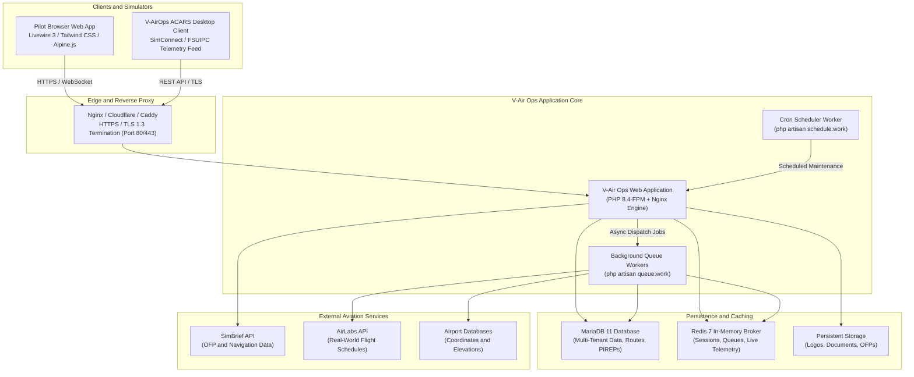

# V-Air Ops

[](https://laravel.com)
[](https://php.net)
[](https://livewire.laravel.com)
[](https://tailwindcss.com)
[](https://mariadb.org)
[](https://redis.io)
[](https://www.docker.com)

**V-Air Ops** is a modern, high-performance, multi-tenant Virtual Airline SaaS operations platform, flight dispatch network, and real-time ACARS flight tracking ecosystem. Built for the modern flight simulation community (MSFS 2024 / 2020, Prepar3D, X-Plane), V-Air Ops provides complete airline lifecycle management—from schedule synchronization and SimBrief dispatching to precision PIREP landing analysis and custom tenant branding.

---

## 🏗️ High-Level Architecture



---

## 🌟 Core System Capabilities

- 🏢 **True Multi-Tenant Architecture**: Host independent Virtual Airlines on a single platform with isolated fleets, routes, ranks, scoring rules, and visual identities.
- 🎨 **Dynamic Tenant Branding**: Full color palette customizer (accent, panel backgrounds, card backgrounds, form inputs, buttons) with automated contrast luminance calculation.
- 📡 **Real-Time ACARS Telemetry Engine**: 11-stage automated flight phase state machine with live position mapping, G-force monitoring, and touchdown physics tracking.
- 🛬 **Precision PIREP Evaluation**: Deterministic scoring based on touchdown vertical speed (FPM), bank angles, pitch, and flap/gear overspeeds.
- 🗺️ **Global Network Import**: Browse over 200,000+ real-world airline schedules with automated ATC callsign generation and customizable flight number prefix cutoffs.
- 🔍 **Interactive Search Selection Hubs**: Instant search-select dropdowns and omni-search autocompletion across Fleet, Route, Airport, and PIREP Management hubs.
- ✈️ **SimBrief Integration**: Instant OFP generation, route parsing, fuel calculations, and automated aircraft profile pairing.

---

## 🧭 How to Use the Platform

### ✈️ For Flight Simulation Pilots

1. **Join Virtual Airlines**:
   - Register your account and verify your email.
   - Browse public virtual airlines on the network and enroll. You can join and switch between multiple Virtual Airlines seamlessly without separate logins.
2. **Book a Flight**:
   - Navigate to **Flights & Schedules** to explore your airline's scheduled route network.
   - Filter by departure/arrival ICAO, airframe type, or flight duration.
   - Click **Book Flight** to reserve the aircraft for your flight session.
3. **Generate SimBrief Dispatch Briefing**:
   - On your active booking, click **Generate SimBrief OFP**.
   - V-Air Ops auto-populates airframe weights, passenger load, cargo, and fuel reserves into SimBrief, embedding the full navigation log, METARs, TAFs, and route map into your dispatch board.
4. **Fly with V-AirOps ACARS**:
   - Launch the **V-AirOps ACARS** desktop client and click **Fetch Flight**.
   - As you start engines, taxi, take off, cruise, and land, telemetry streams in real time to the **Live 3D Radar Map**.
   - Upon engine shutdown at the arrival gate, your PIREP is automatically compiled, scored (landing rate FPM, G-force), and filed to your permanent pilot logbook.
5. **Career Progression**:
   - Accumulate block flight hours and points to earn automated rank promotions, unlocking higher ranks and heavy widebody airframes.

### 🏢 For Virtual Airline Owners & Operations Staff

1. **Brand & Configure Your Airline**:
   - Customize your airline logo, icons, telephony callsign, minimum landing rates, and preferred SimBrief OFP layout.
2. **Establish Operating Hubs**:
   - Designate base airports and regional focus hubs with defined runway and terminal operations.
3. **Manage Fleet & Schedules**:
   - Register airframes (A320, B738, B77W, etc.) with tail registrations, seating configs, and real-time maintenance statuses.
   - Create route networks manually or import thousands of real-world seasonal flights using CSV bulk import or the integrated **AirLabs API**.
4. **Enforce Flight Safety & Review PIREPs**:
   - Inspect incoming pilot reports in the **Review Queue**. Review flagged hard landings or overspeed events, leave feedback, and accept/reject PIREPs.
5. **Issue Operations NOTAMs**:
   - Publish high-, medium-, and low-priority notices to your pilots with expiration dates and track unread acknowledgments.
6. **Delegate Staff Roles (RBAC)**:
   - Create custom airline roles (e.g. *Chief Pilot*, *Dispatch Manager*, *Events Coordinator*) and assign airline-scoped permissions.

---

## 🛠️ Technology Stack

| Layer | Component | Version / Details |
|---|---|---|
| **Core Framework** | Laravel Framework | 13.x on PHP 8.4 |
| **Reactive Frontend** | Laravel Livewire & Alpine.js | Livewire 3.x, Alpine.js 3.x |
| **Styling & Design** | Tailwind CSS | Customized theme-aware CSS variables |
| **Database** | MariaDB | 11.x (InnoDB optimized) |
| **Caching & Queues** | Redis | 7.x (Alpine) via phpredis |
| **Web Server** | Nginx | 1.26+ (Alpine) with HTTP/2 and TLS 1.3 |
| **Process Management** | Supervisord | Multi-worker daemon supervisor |
| **Containerization** | Docker & Compose | Multi-stage production container build |

---

## 🚀 Quick Start Guide (Docker Production)

### 1. Prerequisites
- Linux Server (Ubuntu 22.04 / 24.04 LTS or Debian 12)
- Docker Engine 24.0+ and Docker Compose v2.20+
- A registered domain name pointing to your server IP

### 2. Setup & Configuration
```bash
# Clone the repository
git clone https://web2.artmex-hosting.com:2223/tathar26/v-ops.git v-air-ops
cd v-air-ops/v-ops

# Create environment file
cp .env.example .env

# Generate application encryption key
docker run --rm -v $(pwd):/app -w /app composer:2.7 composer install --no-dev
docker run --rm -v $(pwd):/app -w /app php:8.4-cli-alpine php -r "echo 'base64:'.base64_encode(random_bytes(32)).PHP_EOL;"
```
Copy the generated key into your `.env` under `APP_KEY=`.

### 3. Launch Services
```bash
# Start all microservices in the background
docker compose -f docker-compose.prod.yml up -d

# Execute database migrations and seed initial data
docker compose -f docker-compose.prod.yml exec app php artisan migrate --force
docker compose -f docker-compose.prod.yml exec app php artisan db:seed --class=DemoDataSeeder --force
docker compose -f docker-compose.prod.yml exec app php artisan storage:link
```

Access your V-Air Ops instance by navigating to `http://your-server-ip` or your configured domain!

---

## 📚 Complete Wiki Documentation Suite

For detailed step-by-step user manuals, operations playbooks, and architectural references, visit the [V-Air Ops Wiki Documentation](wiki/Home.md):

- 📖 **[Wiki Home](wiki/Home.md)** — Documentation index, roadmap, and repository architecture.
- 🧑‍✈️ **[Pilot & Dispatcher User Guide](wiki/User-Guide.md)** — Step-by-step pilot manual for bookings, SimBrief OFP dispatch, live radar, and PIREPs.
- 🏢 **[Airline Management Manual](wiki/Airline-Management.md)** — Complete staff guide for hubs, fleet, schedules, ranks, NOTAMs, and RBAC.
- 🌟 **[Features & System Capabilities](wiki/Features.md)** — In-depth breakdown of modules, scoring, dispatch, and dynamic branding.
- 🌐 **[Production Deployment Guide](wiki/Deployment.md)** — Bare-metal LEMP setup, Nginx reverse proxy, and SSL/TLS.
- 🐳 **[Docker & Compose Installation](wiki/Docker-Install.md)** — Container topologies, volume mappings, port exposures, and staging stacks.
- ⚙️ **[Configuration Reference](wiki/Configuration.md)** — Complete catalog of all `.env` variables and default values.
- 🔧 **[Troubleshooting & Maintenance](wiki/Troubleshooting.md)** — Log inspection, queue debugging, and maintenance routines.

---

## 📄 License & Attribution
Distributed under the proprietary license of the V-Air Ops development team. Built for the virtual airline and flight simulation community.
