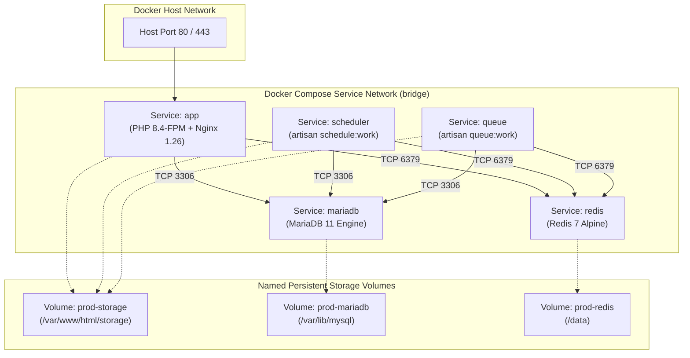

# Docker & Docker Compose Installation Guide

This guide details the container architecture, multi-stage Docker build process, container dependencies, persistent volume mappings, and step-by-step orchestration commands for **V-Air Ops**.

---

## 1. 🐳 Container Ecosystem Overview

The V-Air Ops container infrastructure is orchestrated using Docker Compose across five dedicated micro-services:



---

## 2. 📦 Container Specifications & Port Mapping

| Service | Base Image | Role | Internal Port | Host Port | Depends On |
|---|---|---|---|---|---|
| **`app`** | `tathar26/v-ops:latest` (or built from Dockerfile) | Web server (Nginx + PHP-FPM) | `80/TCP` | `80:80` (or reverse proxy) | `mariadb` (healthy), `redis` |
| **`scheduler`** | `tathar26/v-ops:latest` | Laravel Cron Engine (`schedule:work`) | — | None (Internal) | `mariadb` (healthy), `redis` |
| **`queue`** | `tathar26/v-ops:latest` | Background Queue Workers (`queue:work`) | — | None (Internal) | `mariadb` (healthy), `redis` |
| **`mariadb`** | `mariadb:11` | Relational Database Engine | `3306/TCP` | None (Internal network) | None (Healthchecked) |
| **`redis`** | `redis:7-alpine` | In-memory session & queue broker | `6379/TCP` | None (Internal network) | None |

---

## 3. 💾 Persistent Volumes & Mount Points

To guarantee zero data loss across container recreations and image upgrades:

1. **`prod-storage`** (Mounted to `/var/www/html/storage`):
   - Stores airline logos, pilot profile photos, uploaded flight CSVs, SimBrief XML/OFP caches, and application logs.
   - Shared between `app`, `scheduler`, and `queue` containers.
2. **`prod-mariadb`** (Mounted to `/var/lib/mysql`):
   - Stores all InnoDB tables, indexes, users, routes, and PIREPs.
3. **`prod-redis`** (Mounted to `/data`):
   - Stores append-only Redis persistence snapshots for queues and active session states.

---

## 4. 🛠️ Step-by-Step Production Deployment

### Step 1: Clone Repository
```bash
git clone https://web2.artmex-hosting.com:2223/tathar26/v-ops.git v-air-ops
cd v-air-ops/v-ops
```

### Step 2: Configure Environment Variables
Create `.env` in the `v-ops` directory:
```ini
APP_NAME=V-Air Ops
APP_ENV=production
APP_DEBUG=false
APP_URL=https://vops.yourdomain.com
APP_KEY=base64:YOUR_GENERATED_32_BYTE_KEY_HERE=

DB_CONNECTION=mysql
DB_HOST=mariadb
DB_PORT=3306
DB_DATABASE=vops_prod
DB_USERNAME=vops
DB_PASSWORD=YourStrongDatabasePassword123!
DB_ROOT_PASSWORD=YourStrongRootPassword456!

CACHE_STORE=redis
SESSION_DRIVER=redis
QUEUE_CONNECTION=redis
REDIS_HOST=redis
REDIS_PORT=6379

AIRLABS_API_KEY=your_optional_airlabs_api_key
```

### Step 3: Build or Pull Docker Image
To build the image locally:
```bash
docker build -t tathar26/v-ops:latest -f Dockerfile .
```

Or run directly using the pre-built image in `docker-compose.prod.yml`.

### Step 4: Start the Stack
```bash
# Launch containers in detached mode
docker compose -f docker-compose.prod.yml up -d

# Verify all services are running and healthy
docker compose -f docker-compose.prod.yml ps
```

### Step 5: Initialize Database & Run Migrations
```bash
# Run database migrations
docker compose -f docker-compose.prod.yml exec app php artisan migrate --force

# Seed initial system and sample data (optional for new instances)
docker compose -f docker-compose.prod.yml exec app php artisan db:seed --class=DemoDataSeeder --force

# Create symbolic link for public storage
docker compose -f docker-compose.prod.yml exec app php artisan storage:link
```

---

## 5. 🔄 Staging & Local Development Stacks

The repository includes dedicated compose profiles for testing and local development:

### Staging Environment (`docker-compose.staging.yml`)
- Operates on host port `8080:80`.
- Connects to isolated staging database `vops_staging` and Redis instances.
```bash
docker compose -f docker-compose.staging.yml up -d
```

### Local Development Environment (`docker-compose.local.yml`)
- Enables live volume binding (`./:/var/www/html`) so code edits reflect instantly without rebuilding images.
- Enables `APP_DEBUG=true` and verbose logging.
```bash
docker compose -f docker-compose.local.yml up -d
```

---

## 6. 📋 Routine Container Management Commands

| Task | Command |
|---|---|
| **View Live Logs** | `docker compose -f docker-compose.prod.yml logs -f app` |
| **Inspect Queue Workers** | `docker compose -f docker-compose.prod.yml logs -f queue` |
| **Execute Artisan Command** | `docker compose -f docker-compose.prod.yml exec app php artisan <command>` |
| **Access MariaDB Shell** | `docker compose -f docker-compose.prod.yml exec mariadb mariadb -u vops -p vops_prod` |
| **Restart Stack Gracefully** | `docker compose -f docker-compose.prod.yml restart` |
| **Pull & Update to Latest** | `docker compose -f docker-compose.prod.yml pull && docker compose -f docker-compose.prod.yml up -d` |
