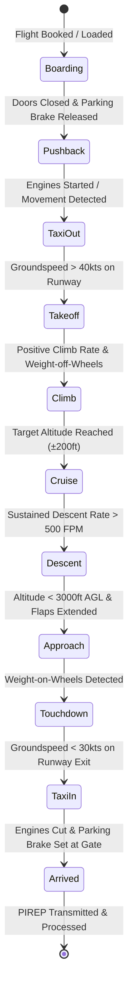

# Features & System Capabilities

A comprehensive deep dive into the modules, telemetry processing systems, management hubs, and aviation algorithms that power the **V-Air Ops** platform.

---

## 1. 🏢 Multi-Tenant Virtual Airline Cloud

V-Air Ops operates as a full Software-as-a-Service (SaaS) platform capable of hosting multiple independent Virtual Airlines on a single unified deployment.

- **Data Isolation**: Each tenant has independent fleets, routes, pilot ranks, scoring criteria, and PIREPs enforced at the database model level via `BelongsToTenant`.
- **Multi-Airline Pilot Membership**: Pilots can be members of multiple airlines with a single account and seamlessly switch active airlines via the topbar menu.
- **Secondary ICAO & Hub Management**: Supports airlines operating with multiple callsign prefixes (e.g. `EZY`, `EZS`, `EJU` for easyJet Group) and multiple international base hubs.
- **Dynamic Color Theming & Branding**: Each VA owner can customize their visual identity:
  - Base accent colors, panel background colors, and card background colors.
  - Form input colors, border colors, and button palettes.
  - Automatic luminance calculation ensures high-contrast readability across all light and dark themes.

---

## 2. 📡 Real-Time ACARS Telemetry & Flight Tracking

The V-Air Ops backend ingest engine streams high-fidelity avionics and flight data from connected flight simulators (MSFS 2024 / 2020, Prepar3D, X-Plane).

### Key Telemetry Metrics Captured:
- **Flight Dynamics**: Indicated Airspeed (IAS), True Airspeed (TAS), Groundspeed (GS), Calibrated Altitude, Pressure Altitude, Pitch, Bank, Heading.
- **Avionics & Systems**: Engine N1/N2/EPR, Fuel Flow, Total Fuel Remaining, Flap Configuration, Gear State, Parking Brake, Transponder (Squawk), and Autopilot Modes.
- **Environmental Factors**: Wind Direction/Speed, Outside Air Temperature (OAT), Barometric Pressure (QNH/Altimeter), and Turbulence G-Forces.
- **Touchdown Physics**: Instantaneous Touchdown Vertical Speed (FPM), Lateral Drift, Landing Pitch, Landing Bank Angle, and Peak Vertical G-Force.

---

## 3. 🛬 Precision PIREP Scoring & Evaluation Engine

PIREPs (Pilot Reports) are scored deterministically upon submission based on airline safety criteria:

| Metric | Optimal Range | Penalty Thresholds |
|---|---|---|
| **Touchdown Rate (FPM)** | $-50$ to $-220$ FPM | Hard landing penalty if $< -600$ FPM; Crash if $< -1200$ FPM |
| **Bank Angle at Touchdown** | $< 3^\circ$ | Penalty if $> 7^\circ$ |
| **Pitch Angle at Touchdown** | $+2^\circ$ to $+7^\circ$ | Tailstrike warning if $> 10^\circ$; Nose-first penalty if $< 0^\circ$ |
| **Flap / Gear Overspeed** | Within placard speeds | Immediate safety penalty if placard speed exceeded |
| **G-Force Limits** | $0.8\text{G}$ to $1.3\text{G}$ | Severe penalty if vertical G exceeds structural thresholds |

- **Staff Workflow**: PIREPs can be set to auto-approve on clean flights or held for manual review with status tracking (`Pending`, `Accepted / Approved`, `Rejected`, `Invalidated`, `Reply Needed`).
- **Audit Trails**: Built-in pilot comment system and staff feedback history.

---

## 4. 🗺️ Global Network Import & Schedule Hub

V-Air Ops includes a global flight repository containing over **200,000+ real-world airline schedules**:

- **Real-World AirLabs API Integration**: Automatically queries AirLabs for real scheduled flight durations and real-world IATA identifiers.
- **Custom Callsign ICAO Prefix & Cutoff**: Users importing routes can select their target airline ICAO (e.g. `EZY`) and specify a flight prefix to strip (e.g. cutting `U2` from `U29999` to produce `EZY9999`).
- **Automatic Airport Coordinate Resolution**: Checks and populates origin/destination airport records, coordinates, and elevations on the fly.
- **Batch Processing**: Dispatches asynchronous chunked jobs to the queue to import thousands of routes in seconds without blocking the web UI.

---

## 5. 🎛️ Interactive Search Selection & Management Hubs

All management centers feature **Interactive Search Selection dropdowns**, **Omni-Search autocompletion**, and instant filtering:

### Fleet Management
- Search Selection for Aircraft Types and omni-search across Airframe Registration, Nickname, and Type Code.
- Dedicated pagination size selectors (25, 50, 100).
- CSV import with automatic aircraft type resolution and downloadable templates.

### Route Management
- Search Selection for Departure Airport, Arrival Airport, Route Type (`Scheduled`, `Charter`, `Cargo`), and Aircraft Types.
- Omnisearch across Flight Number, Callsign, Departure ICAO, Arrival ICAO, Operator, and Route Type.
- **Mass Update Tool**: Select multiple routes to bulk-update airline ICAO prefixes, strip flight number prefixes, sync aircraft types, or delete in bulk.

### Airport Management
- Search Selection for 2-letter geographic region prefixes (e.g. `EG`, `LF`, `KJ`, `ED`).
- Omnisearch across ICAO code, Name, Elevation, and Coordinates.
- Dynamic metadata custom variables (e.g., custom scenery gates, runways).

### PIREP Management
- Search Selection across Departure, Arrival, Status (`Pending`, `Accepted`, `Rejected`, `Invalidated`, `Reply Needed`), and Airframes.
- Omnisearch across Pilot Name, Callsign/Flight #, Departure, Arrival, Airframe Registration/Type, Status, and Touchdown FPM.

---

## 6. ✈️ SimBrief Integration & Dispatch Console

- **One-Click Dispatch**: Connects directly to the SimBrief API using the pilot's SimBrief username or Pilot ID.
- **Automated OFP Parsing**: Extracts route string, planned cruise altitude (FL), block fuel, cargo weight, passenger count, zero fuel weight (ZFW), and alternate airport.
- **Live Cockpit Ingestion**: Actively booked flights and parsed OFPs are instantly synchronized with telemetry and live tracking radar.
