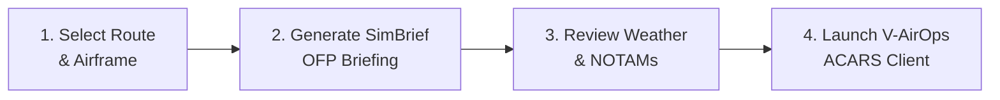

# V-Air Ops — Pilot & Dispatcher User Guide

*Last Updated: September 2026 | Platform Version: v1.1.31*

Welcome to the comprehensive flight operations manual for pilots and flight dispatchers using the **V-Air Ops** Virtual Airline platform. This guide walks you through every step of your virtual aviation journey—from onboarding to booking, in-flight telemetry tracking, and logbook career progression.

---

## 📑 Guide Navigation

1. [Account Setup & Multi-Airline Enrollment](#1-account-setup--multi-airline-enrollment)
2. [Exploring Routes & Fleet](#2-exploring-routes--fleet)
3. [Booking Flights & Dispatching with SimBrief](#3-booking-flights--dispatching-with-simbrief)
4. [In-Flight Tracking & Live 3D Radar](#4-in-flight-tracking--live-3d-radar)
5. [PIREPs, Touchdown Analysis & Scoring](#5-pireps-touchdown-analysis--scoring)
6. [Pilot Profile, Rank Progression & Preferences](#6-pilot-profile-rank-progression--preferences)

---

## 1. Account Setup & Multi-Airline Enrollment

### Registration & Email Verification
1. Navigate to your airline's V-Air Ops portal URL (e.g. `https://v-airops.artmex-hosting.com/register`).
2. Fill out your First Name, Last Name, Email, Password, and select your initial callsign.
3. Once submitted, verify your email via the secure activation link sent to your inbox.

### Joining Virtual Airlines (Multi-Tenancy)
V-Air Ops features **full multi-tenant isolation**. A single pilot account can belong to multiple virtual airlines simultaneously:
- **Join an Airline**: From your pilot dashboard or the `/onboarding/select-airline` route, browse available public virtual airlines and click **Join Virtual Airline**.
- **Switch Active Airline**: Click your profile dropdown in the top-right navigation bar or use the airline switcher menu. Your active flight schedules, fleet, ranks, and logbook will immediately switch context without requiring multiple logins.

---

## 2. Exploring Routes & Fleet

### Route Directory
Navigate to **Flights & Schedules** in the main sidebar:
- **Search Filters**: Filter by Departure ICAO, Arrival ICAO, Aircraft Type, Minimum Flight Time, or Flight Number.
- **Route Cards**: Each card displays distance in nautical miles (NM), estimated block time, scheduled departure/arrival times, and assigned aircraft airframes.
- **Bid / Book**: Click **Book Flight** to reserve the leg for your active pilot session.

### Fleet & Aircraft Information
Navigate to **Fleet Roster**:
- View all operational airframes assigned to your active airline.
- Check registration tail numbers (e.g., `G-VAIR`, `N101VO`), exact passenger and cargo capacities, current airport location, and maintenance status.

---

## 3. Booking Flights & Dispatching with SimBrief

### Creating a Booking
1. Locate your desired flight on the **Schedules** page.
2. Click **Book Flight**. The system verifies:
   - Your pilot rank meets the minimum rank requirement for the chosen airframe.
   - The aircraft is currently stationed at the departure airport.
   - No conflicting active booking exists for that airframe.
3. Once reserved, your booking will appear on your **Dispatch Dashboard**.

### SimBrief OFP Integration
1. On your active booking page, click **Generate SimBrief OFP**.
2. V-Air Ops automatically transmits all flight details to SimBrief:
   - Aircraft ICAO & SimBrief airframe profile.
   - Scheduled departure, arrival, and alternate airports.
   - Planned passenger and cargo payload based on airline load factors.
   - Current fuel reserve requirements.
3. The generated Operational Flight Plan (OFP) is embedded directly inside V-Air Ops, providing:
   - Route waypoints, airways, and Step Climb altitudes.
   - METAR & TAF weather briefings for departure, destination, and alternates.
   - Route map and interactive navlog.

---

## 4. In-Flight Tracking & Live 3D Radar

V-Air Ops features a high-performance **Live Flight Radar Map** accessible from the top navigation bar or `/profile/map`.

### Real-Time Telemetry View
- **Live Aircraft Icons**: Real-time position coordinates streaming at 1Hz from the **V-AirOps ACARS** desktop client.
- **Interactive Flight Popups**: Click any aircraft to inspect:
  - Callsign, Flight Number & Pilot Name.
  - Departure & Destination ICAOs with planned flight path arc.
  - Current Altitude, Ground Speed, Indicated Airspeed, and Vertical Speed.
  - Current Flight Phase (Boarding, Taxi, Climb, Cruise, Descent, Final, Landed).
- **Airport Hub Overlay**: Hub icons indicate departure and destination hub traffic.

---

## 5. PIREPs, Touchdown Analysis & Scoring

### Automated PIREP Ingestion
When your flight finishes and the **V-AirOps ACARS** client detects engine shutdown at the arrival gate, a detailed Pilot Report (PIREP) is automatically compiled and transmitted via encrypted TLS to the V-Air Ops platform.

### Touchdown Quality & Safety Analysis
Every PIREP automatically calculates flight performance analytics:
- **Landing Rate (FPM)**: Precise vertical speed at the exact moment of main gear strut compression.
- **Touchdown G-Force**: Peak vertical acceleration measured in Gs.
- **Landing Assessment**:
  - *Butter / Smooth*: `< -150 FPM`
  - *Firm / Standard*: `-150` to `-350 FPM`
  - *Hard Landing*: `-350` to `-600 FPM` (Flagged for staff review)
  - *Severe / Crash*: `> -600 FPM` or `> 2.5G`
- **Flight Route Telemetry Replay**: Full breadcrumb trace showing altitude profile and speeds from gate to gate.

### Manual PIREP Submission
If offline or flying without the ACARS client (where allowed by airline rules):
1. Navigate to **PIREPs > File Manual PIREP**.
2. Enter Departure, Arrival, Airframe, Block Off/On times, Fuel Used, and paste your flight route.
3. Submit for airline staff approval.

---

## 6. Pilot Profile, Rank Progression & Preferences

### Pilot Career Progression
- **Flight Hours & Points**: Every accepted PIREP adds block hours and points to your pilot profile for that specific Virtual Airline.
- **Automated Rank Promotions**: As your flight time meets rank thresholds (e.g. Cadet &rarr; First Officer &rarr; Captain &rarr; Senior Captain), the system automatically updates your rank and unlocks larger airframes.

### Customizing Pilot Preferences
Navigate to **Preferences** in your user menu:
- **Measurement Units**: Toggle between Metric (kg, km, meters) and Imperial (lbs, nm, feet).
- **SimBrief OFP Layout**: Choose your favorite operational flight plan format (LIDO, Ryanair, American Airlines, British Airways, Delta, Lufthansa, easyJet, etc.).
- **Online Networks**: Enter your VATSIM ID, IVAO VID, POSCON CID, or streaming channel handles.
- **Display Rank Mode**: Choose between standard flight-hour ranks or honorary staff ranks (if assigned staff roles).
- **Delete / Leave Virtual Airline**: Safely delete your profile from an individual airline without losing your overall user account, or completely remove your account.
